```{r setup, include=FALSE}
options(htmltools.dir.version = FALSE)
```


## Motivation:

- Regional disparities in educational outcomes still persist 
- Financial resources have been intensified 
- Government of Indonesia implemented the rule of 20 percent budgeting for educational funds. 
- There are relative few studies that evaluate the role of spatial effects on the educational process.
- Lack of academic literature on educational development at the sub-national level in Indonesia. 

  
## Research Question:
- Does role of neighborhood effect exist in altering the educational outcomes between proximate provinces? 
- What are the significant variables affecting the educational outcomes across provinces?
- How is the magnitude of those variables and spill-over effects to the educational outcomes across provinces?

  
## Methods:

- Spatial autocorrelation (Moran's I and LISA)
- Spatial Panel Models (SAR,SEM,SAC,SDM region-fixed effect)

---

class: middle

## Main Results:

1. **Significant Spatial Autocorrelation** at the province level. 

2. **Spatial model**
  
  - Spatial Durbin Model is the best specification model
  - Number of educational institutions and pupil-teacher ratio are two key factors affecting educational outcomes across provinces in Indonesia
  - Number of educational institutions (elementary school and senior high school) have indirect effect to the educational outcome.

3. **Policy Implication**

  - Increasing spatially better coordination and cooperation on educational development connectivity between local governments especially in the Eastern part and outer islands 
  - Improving educational infrastructures
  


---

class: middle

# Outline of this presentation

1. **Introduction** and **Data**

2. **Spatial autocorrelation** 

  - Moran's I Scatter Plot
  - Local Indicators of Spatial Autocorrelation

3. **Spatial Panel Model **
  - Cross-sectional dependence test in the panel data 
  - OLS Fixed Effect vs Some Spatial Panel Model with Region Fixed-Effect
  - Direct and Indirect Effect

4. **Concluding Remarks**


<br />
<br />
[ Slides and paper available at: https://asrs-slides-2021.netlify.app/#1]

---

class: center, middle

# (1) Some stylized facts

**Educational Outcome disparities across districts over time **

**Educational Outcome disparities across islands over time**


---

class: middle,center

#Disparities in mean years of schooling across districts over time


**Note: X-axis reflects mean years of schooling, Y-axis reflects expected years of schooling, human development index is reflected by the dot size and name of island is reflected by the dot color** 

---

class: middle,center

# Violin Chart of Mean Years Schooling Dispersion across Islands in Indonesia

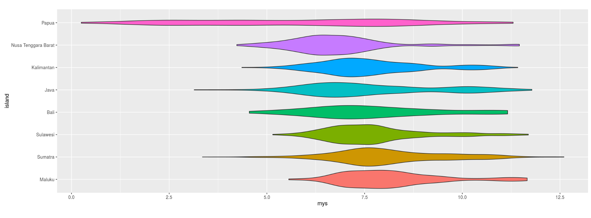

---

class: middle,center

# (1) Data

**Mean years of schooling 2010-2018 at province level**

**Expected years of schooling 2010-2018 at province level**

**Number of elementary schools, junior high schools, and senior high schools 2010-2018 at province level**

**Pupil-teacher ratio in elementary school, junior high school, and senior high school**

**All data are derived from Central Bureau Statistics of Indonesia (BPS-Statistics Indonesia)**

---
class: middle

# (3) Spatial Autocorrelation

Global Spatial Autocorrelation : Moran's I Statistics

Local Indicators of Spatial Autocorrelation (LISA)


---
class: middle, center

# Global spatial Autocorrelation

## Mean Years of Schooling 

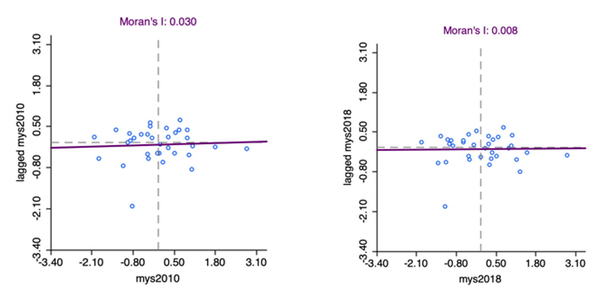
Global spatial autocorrelation is measured based on the Moran’s I, which is statistically significant at 5% level for all years.

---
class: middle, center

## Expected Years of Schooling 

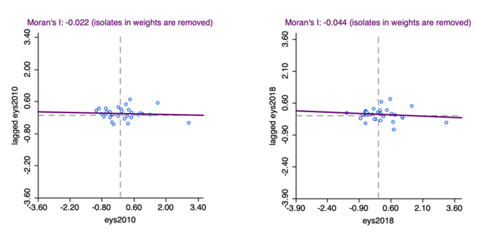


---
class: middle, center

# Local Indicators of Spatial Autocorrelation (LISA)

## Mean Years of Schooling Initial period (2010)

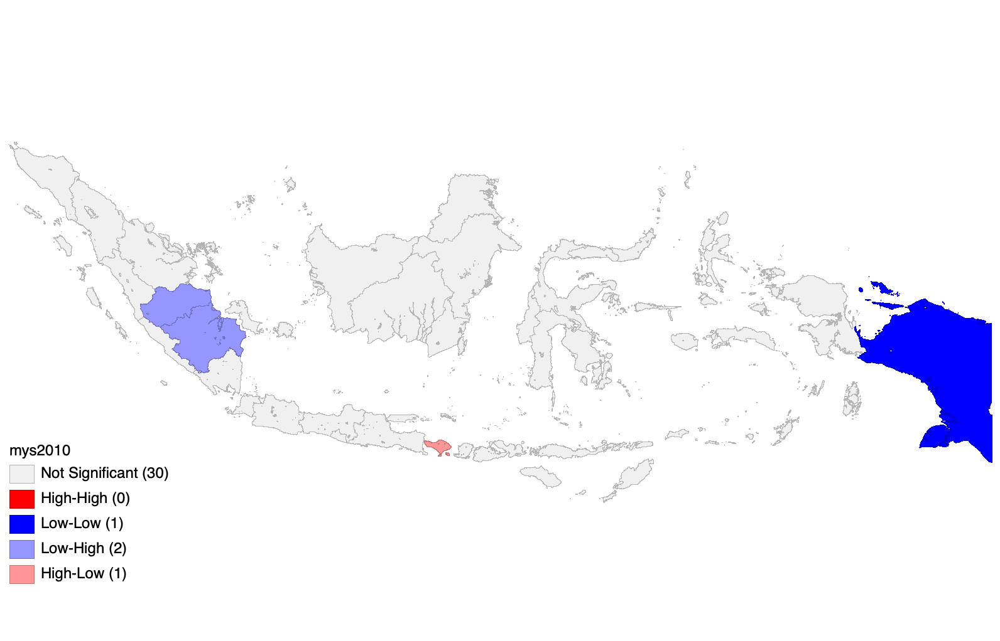

**Note** : Local spatial dependence is significant for both spatial clusters and spatial outliers at 5% significance level

---
class: middle, center

# Local Indicators of Spatial Autocorrelation (LISA)

## Mean Years of Schooling Initial period (2018)

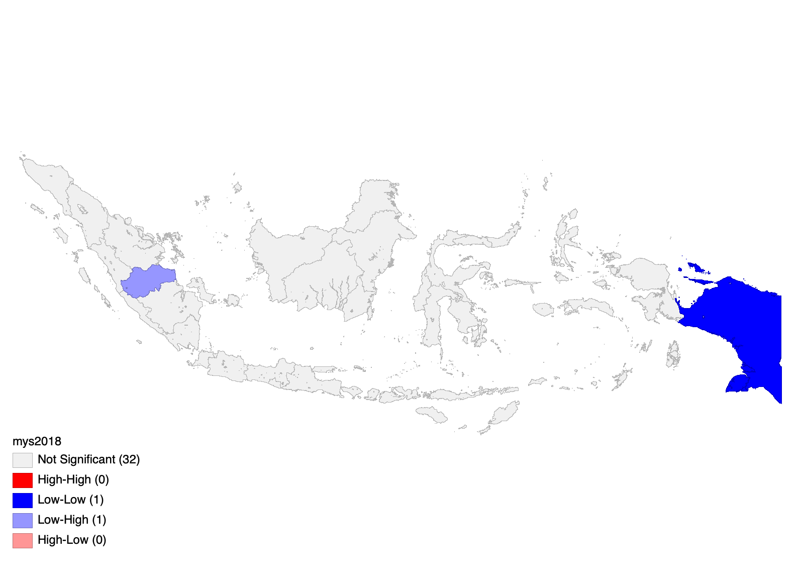 

**Significant cold-spot (spatial cluster with low mean years of schooling surrounded by low mean years of schooling-cluster) located in Papua Province. 

---
class: middle, center

# Local Indicators of Spatial Autocorrelation (LISA)

## Expected Years of Schooling Initial period (2010)

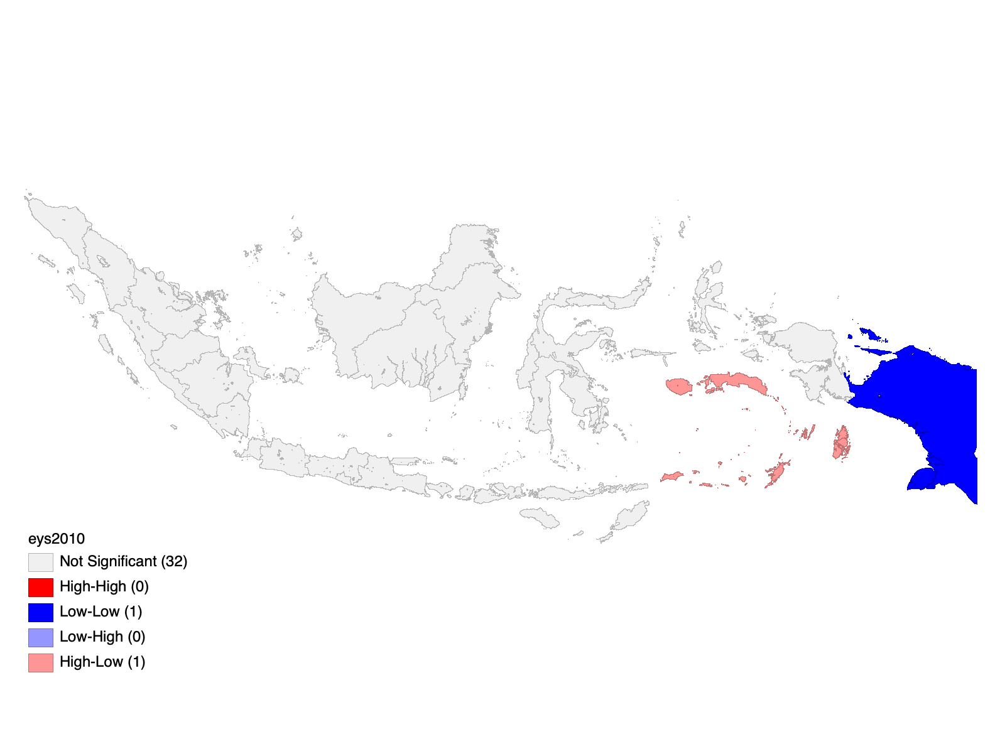 

**Note** : Local spatial dependence is significant for both spatial clusters and spatial outliers at 5% significance level

---
class: middle, center

# Local Indicators of Spatial Autocorrelation (LISA)

## Expected Years of Schooling Initial period (2018)

 

Spatial outlier high-low (spatial cluster with relatively high expected years of schooling surrounded by relatively low expected years of schooling cluster) is only significant in Maluku Province.
---
class: middle, center

# Some Spatial Panel Models


---
class: middle, center

# Cross-sectional dependence test in the panel data model

## Pesaran Test for Model of Mean Years of Schooling
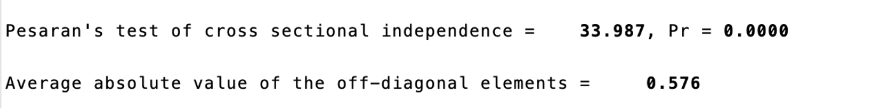

## Pesaran Test for Model of Expected Years of Schooling
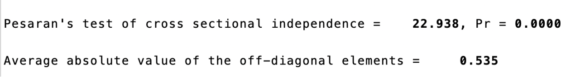

---

class: middle

# Spatial Panel Models for Mean Years of Schooling 

## Spatial Pane Model with Region Fixed-Effect

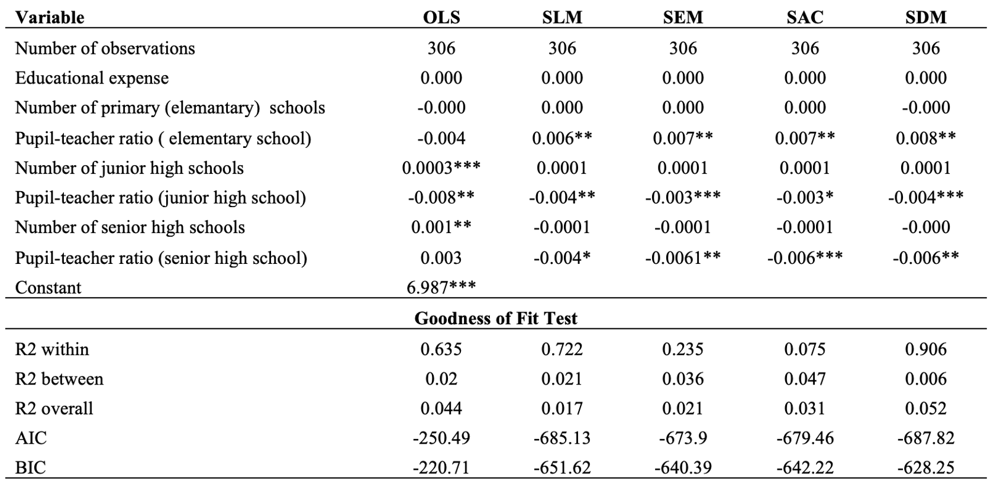
---

class: middle

# Spatial Autocorrelation Parameter

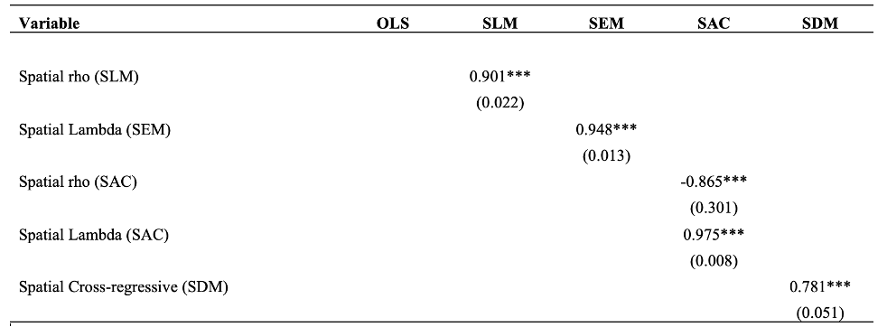
---

class: middle

# Spatial Panel Models for Expected Years of Schooling 

## Spatial Panel Model with Region Fixed-Effect

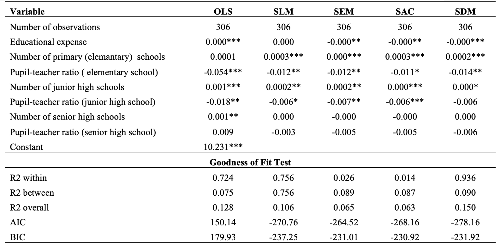
---

class: middle

# Spatial Autocorrelation Parameter

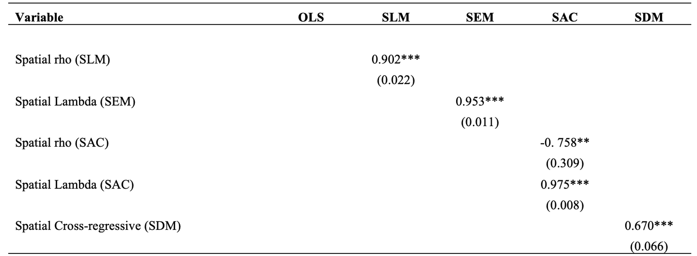
---

class: middle

#Direct and Indirect Effect

## Mean Years Schooling

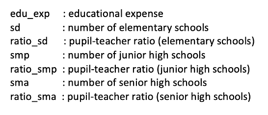 

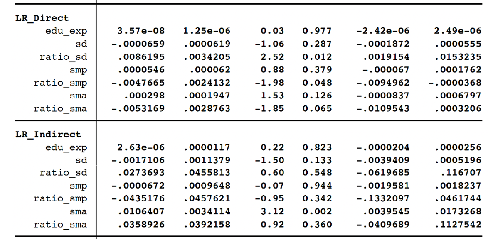 

---

class: middle

#Direct and Indirect Effect

## Expected Years of Schooling

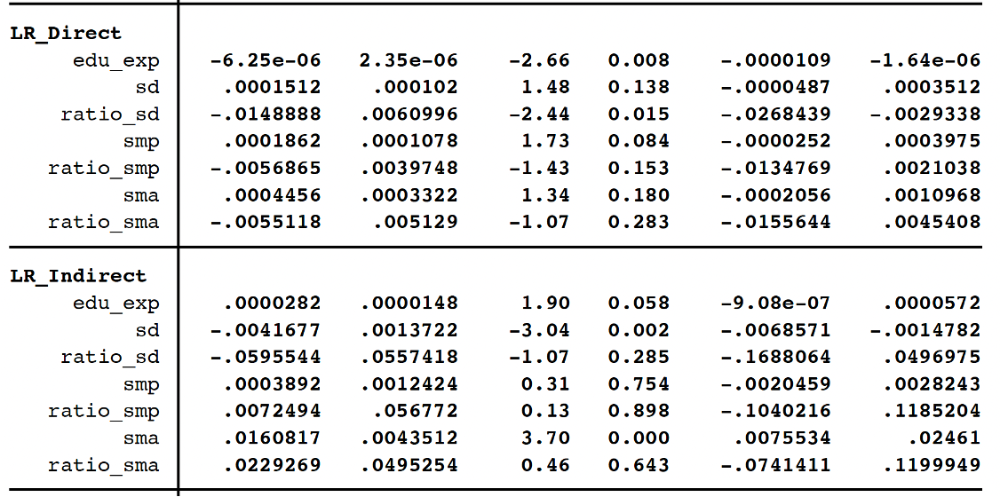
---

class: center, middle

# (5) Concluding Remarks

- **Inequality still matters**. Eastern part of Indonesia need to be the priority of educational development.

- The availability of educational institutions in each level and the pupil-teacher ratio are vital factors to improve the educational outcomes in Indonesia.

- **Spill-over effect does exist**. The indirect effect of availability of schools to the mean years of schooling and expected years of schooling is positive and significant.

-

---

class: center, middle

# Thank you very much for your attention


Slides and working paper available at: https://asrs-slides-2021.netlify.app/#1]


**Quantitative Regional and Computational Science lab**

https://quarcs-lab.rbind.io

***


